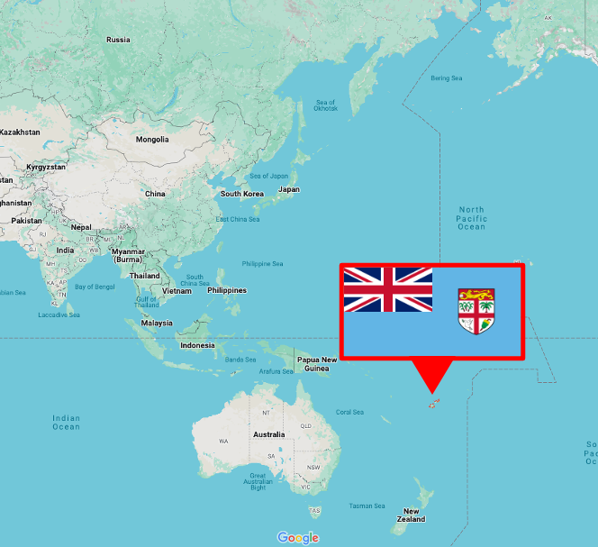
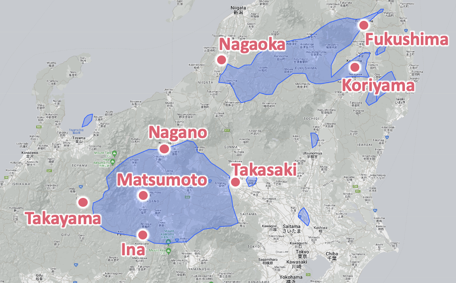
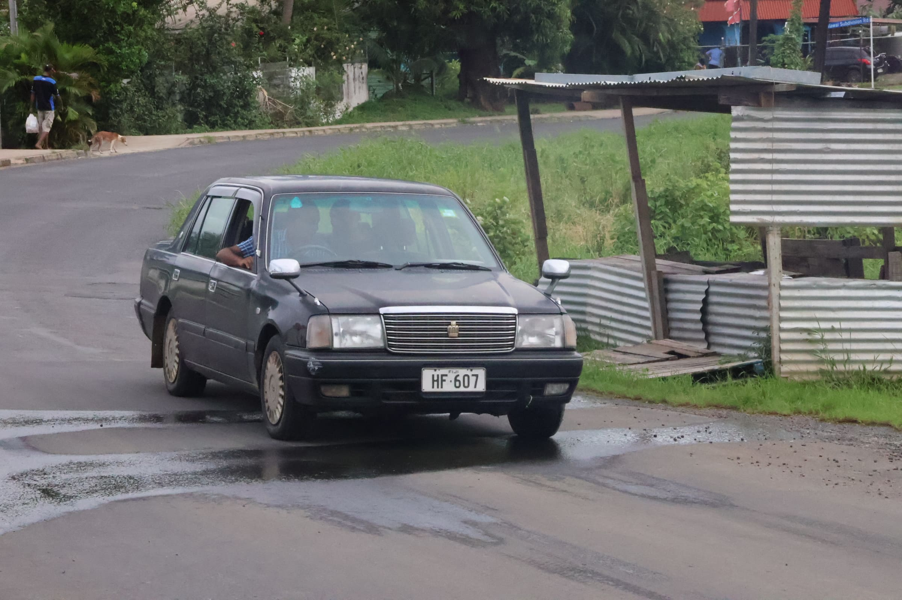
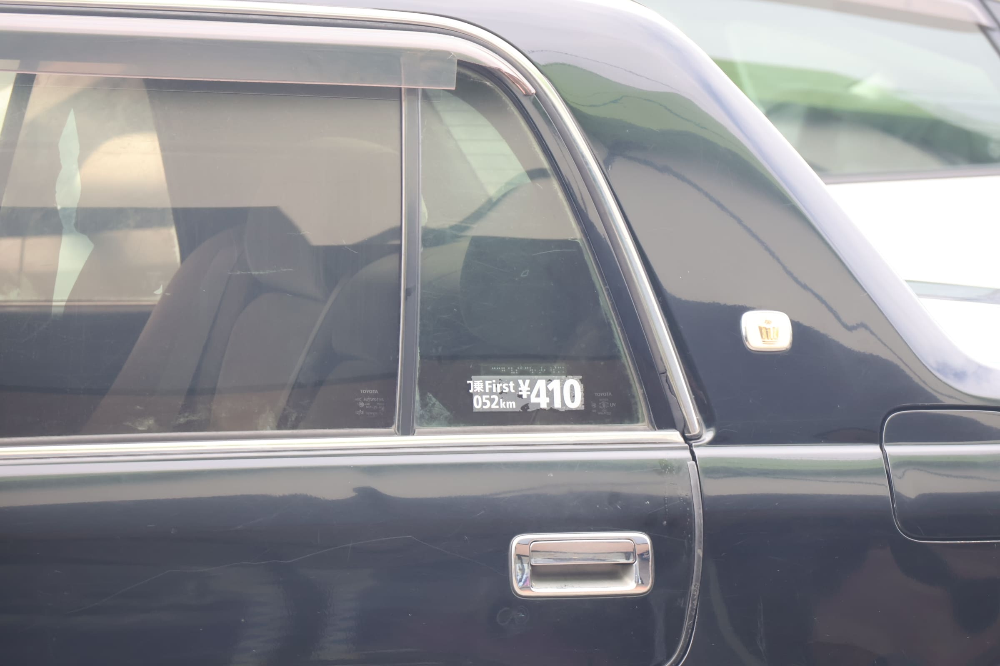
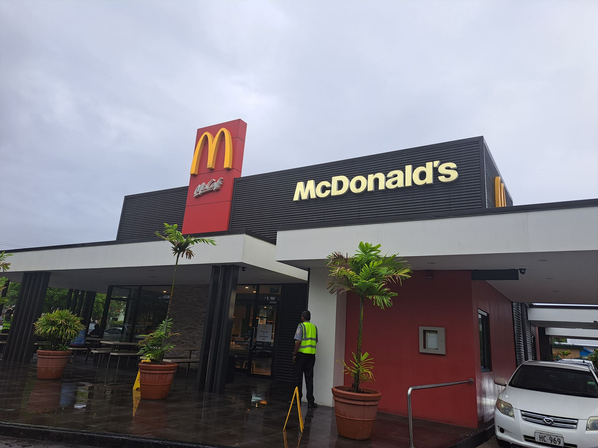
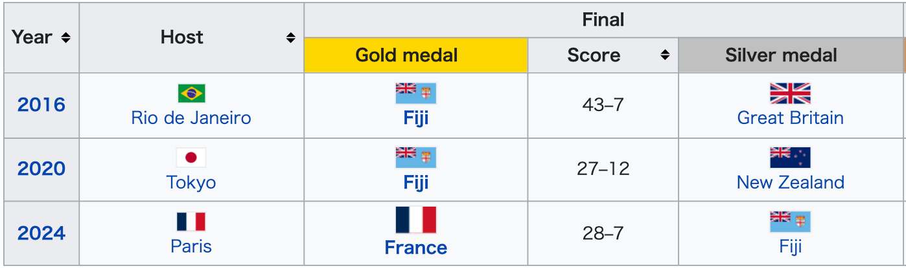
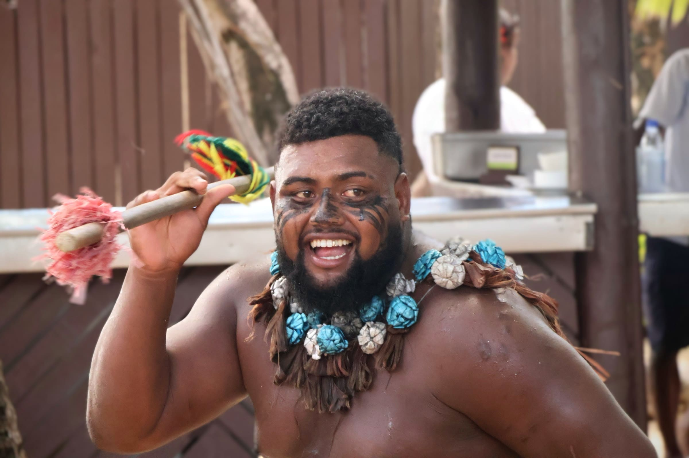

Fiji is an island nation located in Oceania, specifically in Melanesia. 

Its main island's width is comparable to the distance between Nagano and Ina in Japan. 

The country's capital and largest city is Suva, while Nadi is another major city, home to Nadi International Airport. 
Fiji Airways, a state-owned airline, operates direct flights between Narita and Nadi.

The population of Fiji is primarily composed of **native Fijians (54.30%)**, followed by **Indo-Fijians (38.10%)**, with other ethnic groups making up the remaining 7.60%. 

Fijians are known for being **very friendly**, often greeting visitors with **"Bula!"** which means "Hello!".

## Memorable Experiences from My Fiji Trip

### Why So Many Japanese Cars?

One surprising observation was the prevalence of **Japanese cars**. This is due to several reasons:

- **Left-Hand Traffic:** As a former British colony, Fiji drives on the left side of the road.
- **High Import Tax:** There's a 100% import tax on new cars in Fiji.
- **Durability and Right-Hand Drive:** Fijians value high-quality used cars with right-hand drive, making Japanese imports highly sought after.

Among the Japanese cars driven in Fiji, there were some that still had **the taxi stickers** from their time in Japan.

### An Interesting Political System
Fiji has a unique political structure. 
It is a Republic where the President serves as the head of state. 
While the role is largely ceremonial, similar to the Emperor of Japan, the President does hold important reserve powers and is the commander-in-chief of the military. 

The President is appointed by the Parliament for a three-year term, which can be renewed once, under the 2013 Constitution. 
This contrasts with some other former British colonies that still maintain the British monarch as their head of state. 
The office of the president was established after military coups in 1987 led to the proclamation of a republic.

### Incredibly Friendly People!
The warmth and hospitality of the Fijian people left a lasting impression. 
Their welcoming nature truly made the experience special.

### Food Scene
In Fiji, you can find familiar international hamburger chains like Burger King and McDonald's. 

However, I highly recommend trying the traditional Fijian dish called Kokoda, which is raw fish marinated in coconut milk. 
You can also find fresh fruit at low prices in places like Nadi Town.

### Passion for Rugby
Fiji has a formidable rugby team! Their men's rugby sevens team won **gold medals** at **the 2016 Rio de Janeiro Olympics**, defeating Great Britain 43-7, and again at **the 2020 Tokyo Olympics**, beating New Zealand 27-12. 

This achievement is even commemorated on **a special 7 Fiji dollar memorial bill**.

### South Sea Island: A Must-Visit
Just an hour's boat ride from Nadi International Airport is South Sea Island, a beautiful destination known for its stunning waters and delicious food. You can also enjoy traditional Fijian dance performances there.

While on South Sea Island, a staff member selling drinks approached me and asked, "Do you drink alcohol?" Fijians are very friendly, so they often strike up conversations right away. I replied, 
**"I'm 18 now, so I don't drink."** 

But he immediately countered, 
**"It's legal here!"**

Unlike Japan, where the drinking age is 20, in Fiji, it's 18. After a moment's hesitation, I responded, 
**"I want my first drink to be in my home country."** 

I ended up ordering a Sprite. 

However, when I later saw Asahi Super Dry, a popular Japanese beer, on the menu, I couldn't help but feel a slight regret, thinking, 
**"I should have had it."**

Fiji is a fun-filled island country in Oceania with a strong rugby team and beautiful resorts, and above all, incredibly friendly people.

